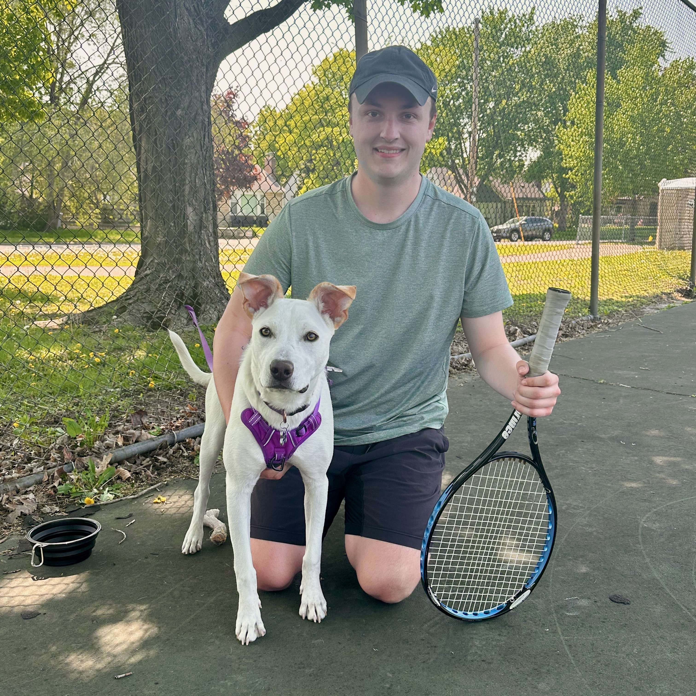

  
  

    <h2>About Me</h2>
    

      I’m a data scientist with 4 years of experience leading analytics and machine learning projects from ambiguous problems to actionable solutions. I specialize in owning the full lifecycle — from pipeline design and data cleaning to modeling, interpretation, and presenting insights to both technical and non-technical audiences. I hold a Master’s in Data Science and thrive in spaces where business context and technical depth meet.
    

  

## Highlighted Projects

### [Tabular Neural Network](./tabular_neural_network/)
Predicts structured data outcomes using a deep learning model built for tabular inputs.

### [Resume Tailor GenAI](./resume_tailor_genai/)
Uses a generative AI agent to customize resumes to job descriptions using NLP and LLMs.

### [Fantasy Football Predictive Model](./fantasy_football_predictive_model/)
Predicts fantasy football points using historical NFL data and regression. Combines feature engineering, ensemble models, and SHAP interpretability.

---

## All Projects (Grouped by Skill)

### 🧮 Regression Models
- [Car Price Estimation](./car_price_estimation_linear_regression/)
- [Fuel Efficiency Regression](./fuel_efficiency_regression/)
- [Fantasy Football Predictive Model](./fantasy_football_predictive_model/)

### 🧬 Classification Models
- [Heart Disease Classification](./heart_disease_classification/)
- [Loan Approval Logistic Regression](./loan_approval_logistic_regression/)
- [Supervised Learning Diabetes Detection](./supervised_learning_diabetes_detection/)
- [Survival Logistic Regression](./survival_logistic_regression/)

### 🤖 NLP & Sentiment
- [Customer Review Sentiment Analysis](./customer_review_sentiment_analysis/)
- [Resume Tailor GenAI](./resume_tailor_genai/)

### 🧰 ML Infrastructure & Pipelines
- [Data Pipeline Building](./data_pipeline_building/)

### 📊 Data Visualization
- [Data Viz Business Recommendations](./data_viz_business_recommendations/)

### 🧠 Deep Learning & Neural Networks
- [CNN Image Classification](./cnn_image_classification/)
- [Tabular Neural Network](./tabular_neural_network/)

### 🎓 Clustering & Unsupervised
- [ALS Patient Clustering](./als_patient_clustering/)

---

## Contact

I'm always open to connecting or collaborating.

-  Email: [blackford9998@gmail.com](mailto:blackford9998@gmail.com)  
-  LinkedIn: [nblackford](https://www.linkedin.com/in/nblackford/)  
-  GitHub Repo: [nickblackford.github.io](https://github.com/nickblackford/nickblackford.github.io/tree/main)

